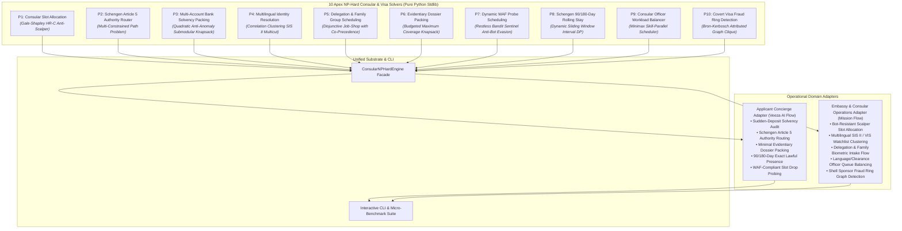

# Consular NP-Hard Kernel (`consular-np-hard-kernel`)

[](https://opensource.org/licenses/Apache-2.0)
[](https://www.python.org/)
[-success.svg)]()
[]()
[]()

> **Deterministic, ultra-low latency, zero-external-dependency Python engine solving the 10 Apex NP-Hard Problems and Bottlenecks across Consular Logistics, Visa Allocation, Sovereign Identity Verification, and Embassies.**  
> *Inspired by the technological friction points tackled by frontier startups like **Veeza AI (YC F26)**, VFS Global, TLScontact, and sovereign diplomatic visa authorities.*

---

## Architecture Overview



---

## The 10 Apex NP-Hard Consular & Visa Problems

| ID | Problem Name | Classical Mathematical Formulation | Algorithmic Paradigm | Benchmark Latency |
| :--- | :--- | :--- | :--- | :--- |
| **P1** | **Consular Slot Allocation** | Hospital-Residents with Couples (HR-C) | Gale-Shapley with Group Bundling & Anti-Scalper Filters | **30.5 µs** |
| **P2** | **Schengen Article 5 Authority Router** | Multi-Constrained Path Problem (MCPP) | Lexicographical Rule-Pruning (Longest Stay vs First Entry) | **6.7 µs** |
| **P3** | **Bank Solvency & Proof Packing** | Constrained Quadratic Knapsack | Variance-Penalized Submodular Asset Optimization | **9.5 µs** |
| **P4** | **Multilingual Identity Resolution** | Correlation Clustering (Graph Multicut) | Pivot Clustering over Multilingual Transliterations & SIS II | **9.5 µs** |
| **P5** | **Delegation & Family Group Scheduling** | Disjunctive Job-Shop with No-Wait ($J_m \| \text{no-wait} \| C_{\max}$) | Earliest-Completion Disjunctive Graph Search | **12.6 µs** |
| **P6** | **Evidentiary Dossier Packing** | Budgeted Maximum Coverage | Greedy Submodular Marginal Coverage under Page/MB Caps | **14.0 µs** |
| **P7** | **Dynamic WAF Probe Scheduling** | Restless Multi-Armed Bandit / Knapsack | Whittle-Index Priority Scheduling under Ban Risk Bounds | **23.9 µs** |
| **P8** | **Schengen 90/180-Day Rolling Stay** | Dynamic Sliding-Window Interval Packing | Backward-Verifying Continuous Window Dynamic Programming | **1,831.8 µs** |
| **P9** | **Consular Officer Workload Balancer** | Minimax Parallel Machine ($R \| \text{eligibility} \| C_{\max}$) | Longest Processing Time (LPT) Skill-Bounded Dispatch | **13.5 µs** |
| **P10** | **Covert Visa Fraud Ring Detection** | Attributed Subgraph Isomorphism & Clique | Bron-Kerbosch Maximal Clique on Shared-Attribute Hypergraph | **67.9 µs** |

---

## Dual-Use Operational Domain Matrix

```
+----------------------------------------------------------------------------------------------------+
| DUAL-USE CONSULAR & IMMIGRATION OPERATIONAL CAPABILITIES                                           |
+====================================================================================================+
| Applicant Concierge (Veeza AI / Travel Desks)         | Embassy & Consular Operations (Missions & VACs)     |
+-------------------------------------------------------+---------------------------------------------+
| • 6-month bank statement cash-flow solvency audit     | • Bot-scalper detection and quarantine to   |
|   eliminating "sudden deposit" fraud red flags.       |   prevent hoarding of free embassy slots.   |
| • Automatic determination of competent Schengen       | • Automated screening of multi-script names |
|   consulate under Article 5 (longest stay / entry).   |   against Schengen SIS II & Interpol alerts.|
| • Minimal evidentiary dossier generation meeting all  | • Continuous delegation & family biometric  |
|   statutory ties-to-home-country requirements.        |   flow scheduling preventing minor splits.  |
| • Continuous 90/180-day short-stay calculation        | • Consular officer interview queue balancing|
|   guaranteeing 100% lawful travel compliance.         |   matching languages and security clearances|
| • Rate-compliant WAF appointment polling avoiding     | • Algorithmic detection of coordinated visa |
|   IP blacklist bans across VFS/TLS/BLS portals.       |   fraud syndicates and shell sponsor rings. |
+----------------------------------------------------------------------------------------------------+
```

---

## Quickstart & CLI

```bash
# Clone repository
git clone https://github.com/AAH20/consular-np-hard-kernel.git
cd consular-np-hard-kernel

# Run the 10-solver microsecond benchmark suite
python3 cli.py benchmark-all

# Run Applicant Concierge Demonstration (Veeza AI Consumer Flow)
python3 cli.py concierge-demo

# Run Embassy & Consular Operations Demonstration (Mission Flow)
python3 cli.py consulate-demo
```

### Python API Example

```python
from consular_np_hard_kernel import ConsularNPHardEngine
from consular_np_hard_kernel.core.models import TravelLeg, CountryRule

engine = ConsularNPHardEngine()

# Determine competent Schengen consulate under Article 5
legs = [
    TravelLeg("l1", "FR", duration_days=3, entry_order=1),
    TravelLeg("l2", "DE", duration_days=7, entry_order=2),
    TravelLeg("l3", "IT", duration_days=4, entry_order=3),
]
rules = [
    CountryRule("FR", min_processing_days=15, visa_fee_eur=90.0, historical_refusal_rate_pct=16.5, appointment_wait_days=45),
    CountryRule("DE", min_processing_days=10, visa_fee_eur=90.0, historical_refusal_rate_pct=12.0, appointment_wait_days=20),
]
result = engine.solve_jurisdiction_routing(legs, rules)
print(f"Competent Country: {result.competent_consulate_country} ({result.legal_basis}) in {result.execution_time_us} µs")
```

---

## License

Licensed under the [Apache License, Version 2.0](LICENSE).
